# **To Store or Not? Online Data Selection for Federated Learning with Limited Storage** 

Chen Gong Zhenzhe Zheng Yunfeng Shao gongchen@sjtu.edu.cn zhengzhenzhe@sjtu.edu.cn shaoyunfeng@huawei.com Shanghai Jiao Tong University Shanghai Jiao Tong University Huawei Noah’s Ark Lab Shanghai, China Shanghai, China Beijing, China Bingshuai Li Fan Wu Guihai Chen libingshuai@huawei.com fwu@cs.sjtu.edu.cn gchen@cs.sjtu.edu.cn Huawei Noah’s Ark Lab Shanghai Jiao Tong University Shanghai Jiao Tong University Beijing, China Shanghai, China Shanghai, China 

## **ABSTRACT** 

Machine learning models have been deployed in mobile networks to deal with massive data from diferent layers to enable automated network management and intelligence on devices. To overcome high communication cost and severe privacy concerns of centralized machine learning, federated learning (FL) has been proposed to achieve distributed machine learning among networked devices. While the computation and communication limitation has been widely studied, the impact of on-device storage on the performance of FL is still not explored. Without an efective data selection policy to flter the massive streaming data on devices, classical FL can sufer from much longer model training time (4×) and signifcant inference accuracy reduction (7%), observed in our experiments. In this work, we take the frst step to consider the online data selection for FL with limited on-device storage. We frst defne a new data valuation metric for data evaluation and selection in FL with theoretical guarantees for speeding up model convergence and enhancing fnal model accuracy, simultaneously. We further design ODE, a framework of **O** nline **D** ata s **E** lection for FL, to coordinate networked devices to store valuable data samples. Experimental results on one industrial dataset and three public datasets show the remarkable advantages of ODE over the state-of-the-art approaches. Particularly, on the industrial dataset, ODE achieves as high as 2 _._ 5× speedup of training time and 6% increase in inference accuracy, and is robust to various factors in practical environments. 

## **CCS CONCEPTS** 

• **Human-centered computing** → **Ubiquitous and mobile computing** ; • **Computer methodologies** → _Machine learning_ . 

## **KEYWORDS** 

Federated Learning, Limited On-Device Storage, Data Selection 

Permission to make digital or hard copies of all or part of this work for personal or classroom use is granted without fee provided that copies are not made or distributed for proft or commercial advantage and that copies bear this notice and the full citation on the frst page. Copyrights for components of this work owned by others than the author(s) must be honored. Abstracting with credit is permitted. To copy otherwise, or republish, to post on servers or to redistribute to lists, requires prior specifc permission and/or a fee. Request permissions from permissions@acm.org. _WWW ’23, April 30–May 04, 2023, Austin, TX, USA_ 

© 2023 Copyright held by the owner/author(s). Publication rights licensed to ACM. ACM ISBN 978-1-4503-9416-1/23/04...$15.00 

https://doi.org/10.1145/3543507.3583426 

**ACM Reference Format:** 

Chen Gong, Zhenzhe Zheng, Yunfeng Shao, Bingshuai Li, Fan Wu, and Guihai Chen. 2023. To Store or Not? Online Data Selection for Federated Learning with Limited Storage. In _Proceedings of the ACM Web Conference 2023 (WWW ’23), April 30–May 04, 2023, Austin, TX, USA._ ACM, New York, NY, USA, 12 pages. https://doi.org/10.1145/3543507.3583426 

## **1 INTRODUCTION** 

The next-generation mobile computing systems require efective and efcient management of mobile networks and devices in various aspects, including resource provisioning [7, 23], security and intrusion detection [8], quality of service guarantee [17], and performance monitoring [35]. Analyzing and controlling such an increasingly complex mobile network with traditional human-inthe-loop approaches [53] will not be possible, due to low-latency requirement [62], massive real-time data and complicated correlation among data [2]. For example, in network trafc analysis, a fundamental task in mobile networks, routers can receive/send as many as 5000 packets (≈ 5MB) per second. It is impractical to manually analyze such a huge quantity of high-dimensional data within milliseconds. Thus, machine learning models have been widely applied to discover pattern behind high-dimensional networked data, enable data-driven network control, and fully automate the mobile network operation [5, 6, 55]. 

Despite that ML model overcomes the limitations of human-inthe-loop approaches, its good performance highly relies on the huge amount of high quality data for model training [18], which is hard to obtain in mobile networks as the data is resided on heterogeneous devices in a distributed manner. On the one hand, an on-device ML model trained locally with limited data and computational resources is unlikely to achieve desirable inference accuracy and generalization ability [78]. On the other hand, directly transmitting data from distributed networked devices to a cloud server for centralized learning (CL) will bring prohibitively high communication cost and severe privacy concerns [38, 47]. Recently, federated learning (FL) [46] emerges as a distributed privacy-preserving ML paradigm to resolve the above concerns, which allows networked devices to upload local model updates instead of raw data and a central server to aggregate these local models into a global model. 

**Motivation and New Problem.** For applying FL to mobile networks, we identify two unique properties of networked devices: _limited on-device storage_ and _streaming networked data_ , which have 

3044 

WWW ’23, April 30–May 04, 2023, Austin, TX, USA 

Chen Gong, Zhenzhe Zheng, Yunfeng Shao, Bingshuai Li, Fan Wu, and Guihai Chen 

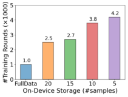

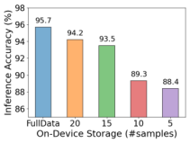

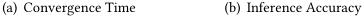

<!-- Start of picture text -->
(a) Convergence Time (b) Inference Accuracy <!-- End of picture text -->

**Figure 1: To investigate the impact of on-device storage on FL model training, we conduct experiments on an industrial traffc classifcation dataset with 30 mobile devices and** 35 _,_ 000+ **data samples under diferent storage capacities.** 

not been fully considered in FL literature. (1) _Limited on-device storage_ : due to the hardware constraints, mobile devices have restricted storage volume for each mobile application and service, and can reserve only a small space to store training data samples for ML without compromising the quality of other services. For example, most smart home routers have only 9-32MB storage [64] and thus only tens of training data samples can be stored. (2) _Streaming networked data_ : data samples are continuously generated/received by mobile devices in a streaming manner, and we need to make online decisions on whether to store each generated data sample. 

Without a carefully designed data selection policy to maintain the data samples in storage, the empirical distribution of stored data could deviate from the true data distribution and also contain low-quality data, which further complicates the notorious problem of not independent and identically distributed (Non-IID) data distribution in FL [31, 43]. Specifcally, the naive random selection policy signifcantly degrades the performance of classic FL algorithms in both model training and inference, with more than 4× longer training time and 7% accuracy reduction, observed in our experiments with an industrial network trafc classifcation dataset shown in Figure 1 (detailed discussion is shown in Appendix C.4). This is unacceptable in modern mobile networks, because the longer training time reduces the timeliness and efectiveness of ML models in dynamic environments, and accuracy reduction results in failure to guarantee the quality of service [17] and incurs extra operational expenses [3] as well as security breaches [4, 63]. Therefore, a fundamental problem when applying FL to mobile network is _how to flter valuable data samples from on-device streaming data to simultaneously accelerate training convergence and enhance inference accuracy of the fnal global model?_ 

**Design Challenges.** The design of such an online data selection framework for FL involves three key challenges: _(1) There is still no theoretical understanding about the impact of local on-device data on the training speedup and accuracy enhancement of global model in FL._ Lacking information about raw data and local models of the other devices, it is challenging for one device to fgure out the impact of its local data sample on the performance of the global model. Furthermore, the sample-level correlation between convergence rate and model accuracy is still not explored in FL, and it is non-trivial to simultaneously improve these two aspects through one unifed data valuation metric. 

_(2) The lack of temporal and spatial information complicates the online data selection in FL._ For streaming data, we could not access the 

data samples coming from the future or discarded in the past. Lacking such _temporal information_ , one device is not able to leverage the complete statistical information ( _e.g.,_ unbiased local data distribution) for accurate data quality evaluation, such as outliers and noise detection [39, 60]. Additionally, due to the distributed paradigm in FL, one device cannot conduct efective data selection without the knowledge of other devices’ stored data and local models, which can be called as _spatial information_ . This is because the valuable data samples selected locally could be overlapped with each other and the local valuable data may not be the global valuable one. 

_(3) The on-device data selection needs to be low computation-andmemory-cost due to the confict of limited hardware resources and requirement on quality of user experience._ As the additional time delay and memory costs introduced by online data selection process would degrade the performance of mobile network and user experience, the real-time data samples must be evaluated in a computation and memory efcient way. However, increasingly complex ML models lead to high computation complexity as well as large memory footprint for storing intermediate model outputs during the data selection process. 

**Limitations of Related Works.** The prior works on data evaluation and selection in ML failed to solve the above challenges. (1) The data selection methods in CL, such as leave-one-out test [16], Data Shapley [22] and Importance Sampling [47, 79], are not appropriate for FL due to the frst challenge: they could only measure the value of each data sample corresponding to the local model training process, instead of the global model in FL. 

(2) The prior works on data selection in FL did not consider the two new properties of FL devices. Mercury [78], FedBalancer [60] and the work from Li _et al._ [39] adopted importance sampling framework [79] to select the data samples with high loss or gradient norm but failed to solve the second challenge: these methods all need to inspect the whole dataset for normalized sampling weight computation as well as noise and outliers removal [28, 39]. 

**Our Solutions.** To solve the above challenges, we design ODE, an online data selection framework that coordinates networked devices to select and store valuable data samples locally and collaboratively in FL, with theoretical guarantees for accelerating model convergence and enhancing inference accuracy, simultaneously. 

In ODE, we frst theoretically analyze the impact of an individual local data sample on the convergence rate and fnal accuracy of the global model in FL. We discover a common dominant term in these two analytical expressions, which can thus be regarded as a reasonable data selection metric in FL. Second, considering the lack of temporal and spatial information, we propose an efcient method for clients to approximate this data selection metric by maintaining a local gradient estimator on each device and a global one on the server. Third, to overcome the potential overlap of the stored data caused by distributed data selection, we further propose a strategy for the server to coordinate each device to store high valuable data from diferent data distribution regions. Finally, to achieve the computation and memory efciency, we propose a simplifed version of ODE, which replaces the full model gradient with partial model gradient to concurrently reduce the computation and memory costs of the data evaluation process. 

**System Implementation and Experimental Results.** We evaluated ODE on _three public_ tasks: synthetic task (ST) [10], Image 

3045 

WWW ’23, April 30–May 04, 2023, Austin, TX, USA 

To Store or Not? Online Data Selection for Federated Learning with Limited Storage 

Classifcation (IC) [73] and Human Activity Recognition (HAR) [40, 54], as well as _one industrial_ mobile trafc classifcation dataset (TC) collected from our 30-days deployment on 30 ONTs in practice, consisting of 560 _,_ 000+ packets from 250 mobile applications. We compare ODE against three categories of data selection baselines: random sampling [65], data selection for CL [39, 60, 78] and data selection for FL [39, 60]. The experimental results show that ODE outperforms all these baselines, achieving as high as 9 _._ 52× speedup of model training and 7.56% increase in fnal model accuracy on ST, 1 _._ 35× and 1.4% on IC, 2 _._ 22× and 6.38% on HAR, 2 _._ 5× and 6% on TC, with low extra time delay and memory costs. We also conduct detailed experiments to analyze the robustness of ODE to various environment factors and its component-wise efect. 

**Summary of Contributions.** (1) To the best of our knowledge, we are the frst to identify two new properties of applying FL in mobile networks: _limited on-device storage_ and _streaming networked data_ , and demonstrate its enormity on the efectiveness and efciency of model training in FL. (2) We provide analytical formulas on the impact of an individual local data sample on the convergence rate and the fnal inference accuracy of the global model, based on which we propose a new data valuation metric for data selection in FL with theoretical guarantees for accelerating model convergence and improving inference accuracy, simultaneously. Further, we propose ODE, an online data selection framework for FL, to realize the on-device data selection and cross-device collaborative data storage. (3) We conduct extensive experiments on three public datasets and one industrial trafc classifcation dataset to demonstrate the remarkable advantages of ODE against existing methods. 

## **2 PRELIMINARIES** 

In this section, we present the learning model and training process of FL. We consider the synchronous FL framework [31, 44, 46], where a server coordinates a set of mobile devices/clients _�_ to conduct distributed model training. Each client _�_ ∈ _�_ generates data samples in a streaming manner with a velocity _��_ . We use _��_ to denote the client _�_ ’s underlying distribution of her local data, and _�_˜ _�_ to represent the empirical distribution of the data samples _��_ stored in her local storage. The goal of FL is to train a global model _�_ from the locally stored data _�_˜ =Ð _�_ ∈ _� �_˜ _�_ with good performance with respect to the underlying unbiased data distribution _�_ = Ð _�_ ∈ _�__�_ _�_: 

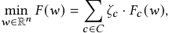

where _��_ =<u>Í</u> _�_′ ∈_�_ _�__<u>�</u>�_ _�_′ denotes the normalized weight of each client, _�_ is the dimension of model parameters, _��_ ( _�_ ) = E( _�,�_ )∼ _��_ [ _�_ ( _�, �,�_ )] is the expected loss of the model _�_ over the true data distribution of client _�_ . We also use _�_˜ _�_ ( _�_ ) = | _�_ <u>1</u> _�_ | Í _�,�_ ∈ _�� �_ ( _�, �,�_ ) to denote the empirical loss of model over the data samples stored by client _�_ . 

In this work, we investigate the impacts of each client’s limited storage on FL, and consider the widely adopted algorithm FedAvg [46] for easy illustration1 . Under the synchronous FL framework, the global model is trained by repeating the following two steps for each communication round _�_ from 1 to _�_ : 

> 1Our results for limited on-device storage can be extended to other FL algorithms, such as FedBoost[25], FedNova[67], FedProx[44]. 

**(1) Local Training:** In the round _�_ , the server selects a client subset _��_ ⊆ _�_ to participate in the training process. Each participating client _�_ ∈ _��_ downloads the current global model _�_ fed_�_−1 (the ending global model in the last round), and performs model updates with the locally stored data for _�_ epochs: 

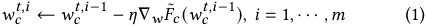

where the starting local model _��__�,_0 is initialized as _�_ fed_�_−1,and_�_ denotes the learning rate. 

**(2) Model Aggregation:** Each participant client _�_ ∈ _��_ uploads the updated local model _��__�,�_ , and the server aggregates them to generate a new global model _�_ fed_�_bytakingaweightedaverage: 

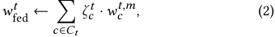

where _��__�_ =<u>Í</u> _�_′ ∈_�_ _��__<u>�</u>�_ _�_′ is the normalized weight of client _�_ . In the scenario of FL with limited on-device storage and streaming data, we have an additional data selection step for clients: **(3) Data Selection:** In each round _�_ , once receiving a new data sample, the client has to make an online decision on whether to store the new sample (in place of an old one if the storage area is fully occupied) or discard it. The goal of this data selection process is to select valuable data samples from streaming data for model training in the coming rounds. 

## **3 DESIGN OF ODE** 

In this section, we frst quantify the impact of a local data sample on the performance of global model in terms of convergence rate and inference accuracy. Based on the common dominant term in the two analytical expressions, we propose a new data valuation metric for data evaluation and selection in FL (§3.1), and develop a practical method to estimate this metric with low extra computation and communication overhead (§3.2). We further design a strategy for the server to coordinate cross-client data selection process, avoiding the potential overlapped data selected and stored by clients (§3.3). Finally, we summarize the detailed procedure of ODE (§3.4). 

## **3.1 Data Valuation Metric** 

We evaluate the impact of a local data sample on FL from the perspectives of convergence rate and inference accuracy, which are two critical aspects for the success of FL. The convergence rate quantifes the reduction of loss function in each training round, and determines the communication cost of FL. The inference accuracy refects the efectiveness of a FL model on guaranteeing the quality of service and user experience. For theoretical analysis, we follow one typical assumption on the FL models, which is widely adopted in the literature [44, 51, 80]. 

Assumption 1. _(Lipschitz Gradient) For each client �_ ∈ _�, the loss function ��_ ( _�_ ) _is �� -Lipschitz gradient,_ i.e. _,_ ∥∇ _���_ ( _�_ 1) − ∇ _���_ ( _�_ 2) ∥2⩽ _��_ ∥ _�_ 1 − _�_ 2 ∥2 _, which implies that the global loss function �_ ( _�_ ) _is �-Lipschitz gradient with �_ = Í _�_ ∈ _�__�_ _�__�_ _�__._ Due to the limitation of space, we provide the proofs of all the theorems and lemmas in our technical report [24]. 

**Convergence Rate.** We provide a lower bound on the reduction of loss function of global model after model aggregation in each communication round. 

3046 

WWW ’23, April 30–May 04, 2023, Austin, TX, USA 

Chen Gong, Zhenzhe Zheng, Yunfeng Shao, Bingshuai Li, Fan Wu, and Guihai Chen 

Theorem 1. _(Global Loss Reduction) With Assumption 1, for an arbitrary set of clients ��_ ⊆ _� selected by the server in round �, the reduction of global loss �_ ( _�_ ) _is bounded by:_ 

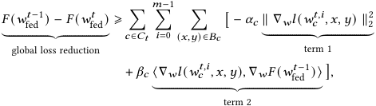

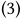

_where 𝛼𝑐_ = 2 _<u>𝐿𝜁𝑐𝑡</u>_· � | _𝐵𝜂𝑐_ | �2 _and 𝛽𝑐_ = _𝜁𝑐𝑡_ · � | _𝐵𝜂𝑐_ | �_._ Due to the diferent magnitude orders of coefcients _��_and _��_ 2 and also the values of terms 1 and 2, as is shown in Appendix B, we can focus on the term 2 (projection of the local gradient of a data sample onto the global gradient) to evaluate a local data sample’s impact on the convergence rate. 

We next briefy describe how to evaluate data samples based on the term 2. The local model parameter _��__�,�_ in term 2 is computed from (1), where the gradient ∇ _��_˜ _�_ ( _��__�,�_−1 ) depends on the “cooperation” of all the stored data samples. Thus, we can formulate the computation of term 2 as a cooperative game [9], where each data sample represents a player and the utility of the whole dataset is the value of term 2. Within this cooperative game, we can regard the individual contribution of each data sample as its value, and quantify it through leave-one-out [16, 34] or Shapley Value [22, 58]. As these methods require multiple model retraining to compute the marginal contribution of each data sample, we propose a one-step look-ahead strategy to approximately evaluate each sample’s value by only focusing on the frst local training epoch ( _�_ = 1). 

**Inference Accuracy.** We can assume that the optimal FL model can be obtained by gathering all clients’ generated data and conducting CL. Moreover, as the accurate testing dataset and the corresponding testing accuracy are hard to obtain in FL, we use the weight divergence between the models trained through FL and CL to quantify the accuracy of the FL model in each round _�_ . With _�_ →∞, we can measure the fnal accuracy of FL model. 

Theorem 2. _(Model Weight Divergence) With Assumption 1, for arbitrary set of participating clients �� , we have the following inequality for the weight divergence after the �__�ℎ_ _training round between the models trained through FL and CL._ 

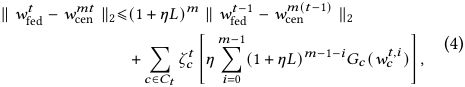

_where 𝐺𝑐_ ( _𝑤_ ) =∥∇ _𝑤𝐹_˜ _𝑐_ ( _𝑤_ ) −∇ _𝑤𝐹_ ( _𝑤_ ) ∥2 _._ 

The following lemma further shows the impact of a local data sample on ∥ _𝑤_ fed_𝑡_ − _𝑤__𝑚𝑡_ cen∥2through _𝐺𝑐_( _𝑤𝑐𝑡,𝑖_ ). Lemma 1. _(Gradient Divergence) For an arbitrary client 𝑐_ ∈ _𝐶, 𝐺𝑐_ ( _𝑤_ ) =∥∇ _𝐹_˜ _𝑐_ ( _𝑤_ ) −∇ _𝐹_ ( _𝑤_ ) ∥2 _is bounded by:_ 

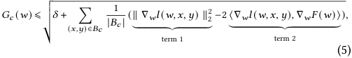

2_𝛼_ _𝛽𝑐𝑐_ ∝ | _𝐵𝜂𝑐_| ≈ 10−4 with common learning rate 10−3 and storage size 10. 

_where �_ =∥∇ _��_ ( _�_ ) ∥2 2_isaconstanttermforalldatasamples._ 

Intuitively, due to diferent coefcients, the twofold projection (term 2) has larger mean and variance than the gradient magnitude (term 1) among diferent data samples, which is also verifed in our experiments in Appendix B. Thus, we can quantify the impact of a local data sample on _��_ ( _�_ ) and the inference accuracy mainly through term 2 in (5), which happens to be the same as the term 2 in the bound of global loss reduction in (3). 

**Data Valuation** . Based on the above analysis, we defne a new data valuation metric in FL, and provide the theoretical understanding as well as intuitive interpretation. 

Definition 1. _(Data Valuation Metric) In the �__�ℎ_ _round, for a client �_ ∈ _�, the value of a data sample_ ( _�,�_ ) _is defned as the projection of its local gradient_ ∇ _�_ ( _�, �,�_ ) _onto the global gradient of the current global model over the unbiased global data distribution:_ 

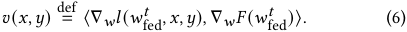

Based on this new data valuation metric, once a client receives a new data sample, she can make an online decision on whether to store this sample by comparing the data value of the new sample with those of old samples in storage, which can be easily implemented as a priority queue. 

_Theoretical Understanding._ On the one hand, maximizing the above data valuation metric of the selected data samples is a onestep greedy strategy for minimizing the loss of the updated global model in each training round according to (3), accelerating model training. On the other hand, this metric also improves the inference accuracy of the fnal global model by narrowing the gap between the models trained through FL and CL, as it reduces the high-weight term of the dominant part in (4), _i.e._ , (1 + _��_ )_�_−1 _��_ ( _��__�,_0 ). 

_�_ 

_Intuitive Interpretation._ The proposed data valuation metric guides the clients to select the data samples which not only follow their own local data distribution, but also have similar efect with the global data distribution. In this way, the personalized information of local data distribution is preserved and the data heterogeneity across clients is also reduced, which have been demonstrated to improve FL performance [11, 67, 74, 77]. 

## **3.2 On-Client Data Selection** 

In practice, it is non-trivial for one client to directly utilize the above data valuation metric for online data selection due to the following two problems: _(1) lack of the latest global model_ : due to the partial participation of clients in FL [29], each client _�_ ∈ _�_ does not receive the global FL model _�_ fed_�_−1 in the rounds that she is not selected, and only has the outdated global FL model from _��,_ last −1 the previous participating round, _i.e._ , _�_ fed ; _(2) lack of unbiased global gradient_ : the accurate global gradient over the unbiased global data distribution can only be obtained by aggregating all the clients’ local gradients over their unbiased local data distributions. This is hard to achieve because only partial clients participate in each communication round, and the locally stored data distribution could become biased during the on-client data selection process. 

We can consider that problem (1) does not afect the online data selection process too much as the value of each data sample remains stable across a few training rounds, which is demonstrated with 

3047 

WWW ’23, April 30–May 04, 2023, Austin, TX, USA 

To Store or Not? Online Data Selection for Federated Learning with Limited Storage 

the experiment results in Appendix B, and thus clients can simply use the old global model for data valuation. 

To solve the problem (2), we propose a gradient estimation method. First, to solve the issue of skew local gradient, we require each client _�_ ∈ _�_ to maintain a local gradient estimator _�_ ˆ _�_ , which will be updated whenever the client receives the _�__�ℎ_ new data sample ( _�,�_ ) from the last participating round: 

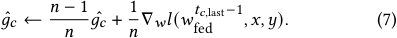

When the client _�_ is selected to participate in FL at a certain round _�_ , the client uploads the current local gradient estimator _�_ ˆ _�_ to the server, and resets the local gradient estimator, _i.e., �_ ˆ _�_ ← 0 _, �_ ← 0, because a new global FL model _�_ fed_�_−1 is received. Second, to solve the problem of skew global gradient due to the partial client participation, the server also maintains a global gradient estimator _�_ ˆ_�_ , which is an aggregation of the local gradient estimators, _�_ ˆ_�_ = Í _�_ ∈ _�__�_ _�__�_ˆ _�_.Asitwouldincurhighcommunicationcosttocollect _�_ ˆ _�_ from all the clients, the server only uses _�_ ˆ _�_ of the participating clients to update global gradient estimator _�_ ˆ_�_ in each round _�_ : 

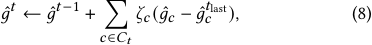

Thus, in each training round _�_ , the server needs to distribute both the current global FL model _�_ fed_�_−1 and the latest global gradient estimator _�_ ˆ_�_−1 to each selected client _�_ ∈ _��_ , who will conduct local model training, and upload both locally updated model _��__�,�_ and local gradient estimator _�_ ˆ _�_ back to the server. 

**Simplifed Version.** In both of the local gradient estimation in (7) and data valuation in (6), for a new data sample, we need to backpropagate the entire model to compute its gradient, which will introduce high computation cost and memory footprint for storing intermediate model outputs. To reduce these costs, we only use the gradients of the last few network layers of ML models instead of the whole model, as partial model gradient is also able to refect the trend of the full gradient, which is also verifed in Appendix B. 

**Privacy Concern.** The transmission of local gradient estimators may disclose the local gradient of each client to some extent, which can be avoided by adding Guassian noise to each local gradient estimator before uploading, as in diferential privacy [19, 69]. 

## **3.3 Cross-Client Data Storage** 

Since the local data distributions of clients may overlap with each other, independently conducting data selection process for each client may lead to distorted global data distribution. One potential solution is to divide the global data distribution into several regions, and coordinate each client to store valuable data samples for one specifc distribution region, while the union of all stored data can still follow the unbiased global data distribution. In this work, we consider the label of data samples as the dividing criterion3 . Thus, before the training process, the server needs to instruct each client the labels and the corresponding quantity of data samples to store. Considering the partial client participation and heterogeneous data distribution among clients, the cross-client coordination strategy need to satisfy the following four desirable properties: 

> 3There are some other methods to divide the data distribution, such as K-means [36] and Hierarchical Clustering [49], and our results are independent on these methods. 

_(1) Efcient Data Selection:_ To improve the efciency of data selection, the label _�_ ∈ _�_ should be assigned to the clients who generate more data samples with this label, following the intuition that there is a higher probability to select more valuable data samples from a larger pool of candidate data samples. 

_(2) Redundant Label Assignment:_ To ensure that all the labels are likely to be covered in each round even with partial client participation, we require each label _�_ ∈ _�_ to be assigned to more than _�_label _�_ clients, which is a hyperparameter decided by the server. _(3) Limited Storage:_ Due to limited on-device storage, each client _�_ should be assigned to less than _��_client labels to ensure a sufcient number of valuable data samples stored for each assigned label, and _��_client is also a hyperparameter decided by the server; _(4) Unbiased Global Distribution:_ The weighted average of all clients’ stored data distribution is expected to be equal to the unbiased global data distribution, _i.e._ , _�_˜ ( _�_ ) = _�_ ( _�_ ) _,_ ∀ _�_ ∈ _�_ . 

We formulate the cross-client data storage with the above four properties by representing the coordination strategy as a matrix _�_ ∈ N|_�_|×|_�_| , where _��,�_ denotes the number of data samples with label _�_ that client _�_ should store. We use matrix _�_ ∈ R|_�_|×|_�_| to denote the statistical information of each client’s generated data, where _��,�_ = _����_ ( _�_ ) is the average speed of the data samples with label _�_ generated by client _�_ . The cross-client coordination strategy can be obtained by solving the following optimization problem, where the condition (1) is formulated as the objective, and conditions (2), (3), and (4) are described by the constraints (9b), (9c), and (9d), respectively: 

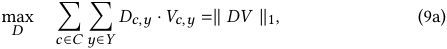

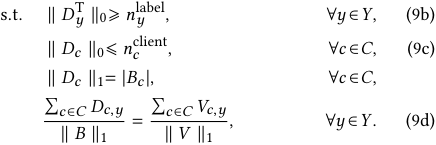

**Complexity Analysis.** We can verify that the above optimization problem with l0 norm is a general convex-cardinality problem, which is NP-hard [21, 50]. To solve this problem, we divide it into two subproblems: (1) decide which elements of matrix _�_ are nonzero, _i.e._ , _�_ = {( _�,�_ )| _��,�_ ≠ 0}, that is to assign labels to clients under the constraints of (9b) and (9c); (2) determine the specifc values of the non-zero elements of matrix _�_ by solving a simplifed convex optimization problem: 

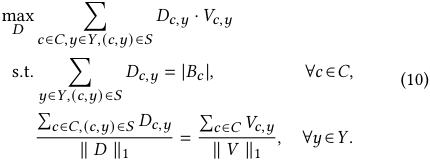

As the number of possible _�_ can be exponential to | _�_ | and | _�_ |, it is still prohibitively expensive to derive the globally optimal solution of _�_ with large | _�_ | (massive clients in FL). The classic approach is to replace the non-convex discontinuous _�_ 0 norm constraints 

3048 

WWW ’23, April 30–May 04, 2023, Austin, TX, USA 

Chen Gong, Zhenzhe Zheng, Yunfeng Shao, Bingshuai Li, Fan Wu, and Guihai Chen 

with the convex continuous _�_ 1 norm regularization terms in the objective function [21], which fails to work in our scenario because simultaneously minimizing as many as | _�_ | + | _�_ | non-diferentiable _�_ 1 norm in the objective function will lead to high computation and memory costs as well as unstable solutions [57, 59]. Thus, we propose a greedy strategy to solve this complicated problem. 

**Greedy Cross-Client Coordination Strategy.** We achieve the four desirable properties through the following three steps: 

_(1) Information Collection:_ Each client _�_ ∈ _�_ sends the rough information about local data to the server, including the storage capacity | _��_ | and data velocity _��,�_ of each label _�_ , which can be obtained from the statistics of previous time periods. Then, the server can construct the vector of storage size _�_ ∈ N|_�_| and the matrix of data velocity _�_ ∈ R|_�_|×|_�_| of all clients. 

_(2) Label Assignment:_ The server sorts labels according to a nondecreasing order of the total number of clients having this label. We prioritize the labels with top rank in label-client assignment, because these labels are more difcult to fnd enough clients to meet _Redundant Label Assignment_ property. For each considered label _�_ ∈ _�_ in the rank, there could be multiple clients to be assigned, and the server allocates label _�_ to clients _�_ who generates data samples with label _�_ in a higher data velocity. By doing this, we attempt to satisfy the property of _Efcient Data Selection_ . Once the number of labels assigned to client _�_ is larger than _��_client , this client will be removed from the rank due to the _Limited Storage_ property. _(3) Quantity Assignment:_ With the above two steps, we have decided the non-zero elements of the client-label matrix _�_ , _i.e._ , the set _�_ . To further reduce the computational complexity and avoid the imbalanced on-device data storage for each label, we do not directly solve the simplifed optimization problem in (10). Instead, we require each client to divide the storage capacity evenly to the assigned labels, and compute a weight _��_ for each label _�_ ∈ _�_ to guarantee that the weighted distribution of the stored data approximates the unbiased global data distribution, _i.e._ , satisfying _���_˜ ( _�_ ) = _�_ ( _�_ ). Accordingly, we can derive the weight _��_ for each label _�_ by setting 

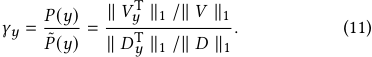

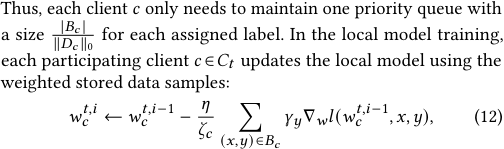

where _��_ =Í ( _�,�_ )∈ _��__�_ _�_denotesthenewweightofeachclient,and the normalized weight of client _�_ ∈ _��_ for model aggregation in _<u>��</u>_ round _�_ becomes _��__�_ = Í _�_ ∈ _��_ <u>Í</u> _�_′ ∈ _��__�_ _�_′ . We illustrate a simple example in Appendix A for better understanding of the above procedure. 

**Privacy Concern.** The potential privacy leakage of uploading rough local information is tolerable in practice, and can be further avoided through Homomorphic Encryption [1], which enables to sort _�_ encrypted data samples with complexity _�_ ( _�_ log _�_2 ) [26]. 

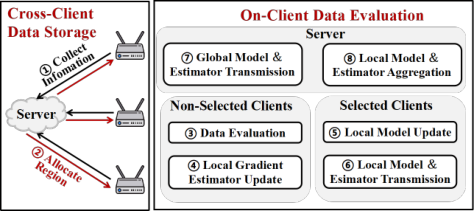

**Figure 2: Overview of ODE framework.** 

## **3.4 Overall Procedure of ODE** 

ODE incorporates cross-client data storage and on-client data evaluation to coordinate mobile devices to store valuable samples, speeding up model training process and improving inference accuracy of the fnal model. The overall procedure is shown in Figure 2. 

**Key Idea.** Intuitively, the cross-client data storage component coordinates clients to store the high-quality data samples with different labels to avoid highly overlapped data stored by all clients. And the on-client data evaluation component instructs each client to select the data having similar gradient with the global data distribution, which reduces the data heterogeneity among clients while also preserves personalized information. 

**Cross-Client Data Storage.** Before the FL process, the central server collects data distribution information and storage capacity from all clients (①), and solving the optimization problem in (9) through our greedy approach (②). 

**On-Client Data Evaluation.** During the FL process, clients train the local model in participating rounds, and utilize idle computation and memory resources to conduct on-device data selection in nonparticipating rounds. In the _�__�ℎ_ training round, non-selected clients, selected clients and the server perform diferent operations: 

• **Non-selected clients** : _Data Evaluation_ (③): each non-selected client _�_ ∈ _�_ \ _��_ continuously evaluates and selects the data samples according to the data valuation metric in (6), within which the clients use the estimated global gradient received in last participation round instead of the accurate global one. _Local Gradient Estimator Update_ (④): the client also continuously updates the local gradient estimator _�_ ˆ _�_ using (7). 

• **Selected Clients** : _Local Model Update_ (⑤): after receiving the new global model _�_ fed_�_−1 and new global gradient estimator _�_ ˆ_�_−1 from the server, each selected client _�_ ∈ _��_ performs local model updates using the stored data samples by (12). _Local Model and Estimator Transmission_ (⑥): each selected client sends the updated model _��__�,�_ and local gradient estimator _�_ ˆ _�_ to the server. The local estimator _�_ ˆ _�_ will be reset to 0 for approximating local gradient of the newly received global model _�_ fed_�_−1. 

• **Server** : _Global Model and Estimator Transmission (_ ⑦ _)_ : At the beginning of each training round, the server distributes the global model _�_ fed_�_−1 and the global gradient estimator _�_ ˆ_�_−1 to the selected clients. _Local Model and Estimator Aggregation_ (⑧): at the end of each training round, the server collects the updated local models _��__�,�_ and local gradient estimators _�_ ˆ _�_ from participating clients _�_ ∈ _��_ , which will be aggregated to obtain a new global model by (2) and a new global gradient estimator by (8). 

3049 

WWW ’23, April 30–May 04, 2023, Austin, TX, USA 

To Store or Not? Online Data Selection for Federated Learning with Limited Storage 

## **4 EVALUATION** 

In this section, we frst introduce experiment setting, baselines and evaluation metrics. Second, we present the overall performance of ODE and baselines on model training speedup and inference accuracy improvement, as well as the memory footprint and evaluation delay. Next, we show the robustness of ODE against various environment factors. We also show _the individual and integrated impacts of limited storage and streaming data on FL_ to show our motivation, and analyze the individual _efect of diferent components_ of ODE, which are shown in Appendix C.4 and C.5 due to the limited space. 

## **4.1 Experiment Setting** 

**Tasks, Datasets and ML Models.** To demonstrate the ODE’s good performance and generalization across various tasks, datasets and ML models. we evaluate ODE on one _synthetic_ dataset, two _realworld_ datasets and one _industrial_ dataset, all of which vary in data quantities, distributions and model outputs, and cover the tasks of Synthetic Task (ST), Image Classifcation (IC), Human Activity Recognition (HAR) and mobile Trafc Classifcation (TC). The statistics of the tasks are summarized in Table 1, and introduced in details in Appendix C.1. 

**Parameters Confgurations.** The main confgurations are shown in Table 1 and other confgurations like the training optimizer and velocity of on-device data stream are presented in Appendix C.2. 

**Baselines.** In our experiments, we compare two versions of ODE, _ODE-Exact_ (using exact global gradient) and _ODE-Est_ (using estimated global gradient), with four categories of data selection methods, including random sampling methods ( _RS_ ), importancesampling based methods for CL ( _HL_ and _GN_ ), previous data selection methods for FL ( _FB_ and _SLD_ ) and the ideal case with unlimited on-device storage ( _FD_ ). These methods are introduced in details in Appendix C.3. 

**Metrics for Training Performance.** We use two metrics to evaluate the performance of each method: (1) _Time-to-Accuracy Ratio_ : we measure the training speedup of global model by the ratio of training time of _RS_ and the considered method to reach the same target accuracy, which is set to be the fnal inference accuracy of _RS_ . As the time of one communication round is usually fxed in practical FL scenario, we can quantify the training time with the number of communicating rounds. (2) _Final Inference Accuracy_ : we evaluate the inference accuracy of the fnal global model on each device’s testing data and report the average accuracy for evaluation. 

## **4.2 Overall Performance** 

We compare the performance of ODE with four baselines on all the datasets, and show the results in Table 2. 

ODE _signifcantly speeds up the model training process._ We observed that ODE improves time-to-accuracy performance over the existing data selection methods on all the four datasets. Compared with baselines, ODE achieves the target accuracy 5 _._ 88×∼9 _._ 52× faster on ST; 1 _._ 20×∼1 _._ 35× faster on IC; 1 _._ 55×∼2 _._ 22× faster on HAR; 2 _._ 5× faster on TC. Also, we observe that the largest speedup is achieved on the datast ST, because the high non-i.i.d degree across clients and large data divergence within clients leave a great potential for ODE to reduce data heterogeneity and improve training process through data selection. 

ODE _largely improves the fnal inference accuracy._ Table 2 shows that in comparison with baselines with the same storage, ODE enhances fnal accuracy on all the datasets, achieving 3 _._ 24%∼7 _._ 56% higher on ST, 3 _._ 13%∼6 _._ 38% increase on HAR, and around 6% rise on TC. We also notice that ODE has a marginal accuracy improvement (≈ 1 _._ 4%) on IC, because the FashionMNIST has less data variance within each label, and a randomly selected subset is sufcient to represent the entire data distribution for model training. 

_Importance-based data selection methods perform poorly._ Table 2 shows that these methods even cannot reach the target fnal accuracy on tasks IC, HAR and TC, as these datasets are collected from real world and contain noise data, making such importance sampling methods fail to work [39, 60]. 

_Previous data selection methods for FL outperform importance based methods but worse than_ ODE. As is shown in Table 2, _FedBalancer_ and _SLD_ perform better than _HL_ and _GN_ , but worse than _RS_ in a large degree, which is diferent from the phenomenon in traditional settings [32, 39, 60]. This is because (1) their noise reduction steps, such as removing samples with top loss or gradient norm, highly rely on the complete statistical information of full dataset, and (2) their on-client data valuation metrics fail to work for the global model training in FL, as discussed in §1. 

_Simplifed_ ODE _reduces computation and memory costs signifcantly with little performance degradation._ We conduct another two experiments which consider only the last 1 and 2 layers (5 layers in total) for data valuation on the industrial TC dataset. Empirical results shown in Figure 3 demonstrate that the simplifed version reduces as high as 44% memory and 83% time delay, with only 1% and 0 _._ 1× degradation on accuracy and speedup. 

ODE _introduces small extra memory footprint and data processing delay during data selection process_ . Empirical results in Table 3 demonstrate that simplifed ODE brings only tiny evaluation delay and memory burden to mobile devices (1 _._ 23ms and 14 _._ 47MB for TC task), and thus can be applied to practical network scenario. 

## **4.3 Robustness of ODE** 

In this subsection, we mainly compare the robustness of ODE and previous methods to various factors in industrial environments, such as the number of local training epoch _�_ , client participation _��_ rate<u>|</u> | _�_ || , storage capacity | _��_ |, mini-batch size and data heterogeneity across clients, on the industrial TC dataset. 

**Number of Local Training Epoch.** Empirical results shown in Figure 4 demonstrate that ODE can work with various local training epoch numbers _�_ . With _�_ increasing, both of _ODE-Exact_ and _ODEEst_ achieve higher fnal inference accuracy than existing methods with same setting. 

**Participation Rate.** The results in Figure 5 demonstrate that ODE can improve the FL process signifcantly even with small participation rate, accelerating the model training 2 _._ 57× and increasing the inference accuracy by 6 _._ 6%. This demonstrates the practicality of ODE in the industrial environment, where only a small proportion of mobile devices could be ready to participate in each FL round. 

**Other Factors.** We also demonstrate the remarkable robustness of ODE to **device storage capacity** , **mini-batch size** and **data heterogeneity across clients** compared with previous methods, which are fully presented in the technical report [24]. 

3050 

WWW ’23, April 30–May 04, 2023, Austin, TX, USA 

Chen Gong, Zhenzhe Zheng, Yunfeng Shao, Bingshuai Li, Fan Wu, and Guihai Chen 

|**Tasks**|**Datasets**|**Models**|#**Samples**|#**Labels**|#**Devices**|_�_label _�_|**|**_��_ **|** **|**_�_ **|**|_�_|_�_|**|**_��_ **|**|
|---|---|---|---|---|---|---|---|---|---|---|
|ST|Synthetic Dataset [10]|LogReg|1_,_ 016_,_ 442|10|200|5|5%|1_�_−4|5|10|
|IC|Fashion-MNIST [73]|LeNet [37]|70_,_ 000|10|50|5|10%|1_�_−3|5|5|
|HAR|HARBOX [54]|Customized DNN|34_,_ 115|5|120|5|10%|1_�_−3|5|5|
|TC|Industrial Dataset|Customized CNN|37_,_ 853|20|30|5|20%|5_�_−3|5|10|

**Table 1: Information of diferent tasks, datasets, models and default experiment settings**6 **.** 

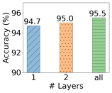

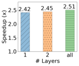

|**Tk**||||**Model** **T**|**raining**|**Speedup**|||
|---|---|---|---|---|---|---|---|---|
|**as**|**RS**|**HL**|**GN**|**FB**|**SLD**|**ODE-Exact**|**ODE-Est**|**FD**|
|ST|1_._0×|−|4_._87×|−|4_._08×|9_._52×|5_._88×|2_._67×|
|IC|1_._0×|−|−|−|−|1_._35×|1_._20×|1_._01×|
|HAR|1_._0×|−|−|−|−|2_._22×|1_._55×|4_._76×|
|TC|1_._0×|−|−|−|−|2_._51×|2_._50×|3_._92×|
|**Task**||||**Infer**|**ence** **Acc**|**uracy**|||
|ST|79_._56%|78_._44%|83_._28%|78_._56%|82_._38%|87_._12%|82_._80%|88_._14%|
|IC|71_._31%|51_._95%|41_._45%|60_._43%|69_._15%|72_._71%|72_._70%|71_._37%|
|HAR|67_._25%|48_._16%|51_._02%|48_._33%|56_._24%|73_._63%|70_._39%|77_._54%|
|TC|89_._3%|69_._00%|69_._3%|72_._19%|72_._30%|95_._3%|95_._30%|96_._00%|

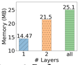

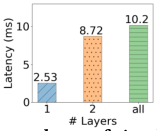

**Figure 3: Performance and cost of simplifed ODE with diferent** # **model layers.** 

**Table 2: ODE’s improvements on model training speedup and inference accuracy. The symbol ’** − **’ means that the method fails to reach the target accuracy.** 

|**Task**|**RS**|**HL**|**Memory** **GN**|**Footprint** **ODE-Est**|**(MB)** **ODE-Simplifed**|
|---|---|---|---|---|---|
|IC|1.70|11.91|16.89|18.27|16.92|
|HAR|1.92|7.27|12.23|13.46|12.38|
|TC|0.75|10.58|19.65|25.15|14.47|
|**Task**|||**Evalua**|**tion** **Time**|**(ms)**|
|IC|0.05|11.1|21.1|22.8|11.4|
|HAR|0.05|0.36|1.04|1.93|0.53|
|TC|0.05|1.03|9.06|9.69|1.23|

**Table 3: The memory footprint and evaluation delay per sample valuation of baselines on three real-world tasks.** 

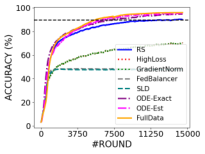

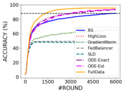

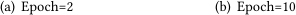

<!-- Start of picture text -->
(a) Epoch=2 (b) Epoch=10 <!-- End of picture text -->

**Figure 4: The training process of diferent sampling methods with various numbers of local epoch.** 

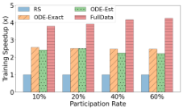

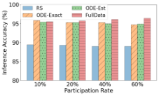

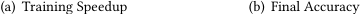

<!-- Start of picture text -->
(a) Training Speedup (b) Final Accuracy <!-- End of picture text -->

**Figure 5: The performance of diferent data selection methods with various participation rates.** 

## **5 RELATED WORKS** 

**Federated Learning** is a distributed learning framework that aims to collaboratively learn a global model over the networked devices’ 

data under the constraint that the data is stored and processed locally [43, 46]. Existing works mostly focus on how to overcome the data heterogeneity problem [11, 14, 70, 77], reduce the communication cost [27, 33, 33, 75], select important clients [15, 38, 42, 52] or train a personalized model for each client [20, 72]. Despite that a few works consider the problem of online and continuous FL [13, 66, 76], they did not consider the device properties of _limited on-device storage_ and _streaming networked data_ . 

**Data Selection.** In FL, selecting data from streaming data can be seen as sampling batches of data from its distribution, which is similar to mini-batch SGD. To improve the training process of SGD, existing methods quantify the importance of each data sample (such as loss [56, 61], gradient norm [30, 79], uncertainty [12, 71], data shapley [22] and representativeness [48, 68]) and leverage importance sampling or priority queue to select training samples. The previous literature [39, 60] on data selection in FL simplify conducts the above data selection methods on each client individually for local model training without considering the global model. And all of them require either access to all the data or multiple inspections over the data stream, which are not satisfed in the mobile network scenarios. 

## **6 CONCLUSION** 

In this work, we identify two key properties of networked FL: _limited on-device storage_ and _streaming networked data_ , which have not been fully explored in the literature. Then, we present the design, implementation and evaluation of ODE, which is an online data selection framework for FL with limited on-device storage, consisting of two components: on-device data evaluation and cross-device collaborative data storage. Our analysis show that ODE improves both convergence rate and inference accuracy of the global model, simultaneously. Empirical results on three public and one industrial datasets demonstrate that ODE signifcantly outperforms the state-of-the-art data selection methods in terms of training time, fnal accuracy and robustness to various factors in industrial environments. 

3051 

WWW ’23, April 30–May 04, 2023, Austin, TX, USA 

To Store or Not? Online Data Selection for Federated Learning with Limited Storage 

## **ACKNOWLEDGMENTS** 

This work was supported in part by National Key R&D Program of China No. 2020YFB1707900, in part by China NSF grant No. 62132018, U2268204, 62272307 61902248, 61972254, 61972252, 620252 04, 62072303, in part by Shanghai Science and Technology fund 20PJ1407900, in part by Huawei Noah’s Ark Lab NetMIND Research Team, in part by Alibaba Group through Alibaba Innovative Research Program, and in part by Tencent Rhino Bird Key Research Project. The opinions, fndings, conclusions, and recommendations expressed in this paper are those of the authors and do not necessarily refect the views of the funding agencies or the government. Zhenzhe Zheng is the corresponding author. 

## **REFERENCES** 

- [1] Abbas Acar, Hidayet Aksu, A Selcuk Uluagac, and Mauro Conti. 2018. A survey on homomorphic encryption schemes: Theory and implementation. _Comput. Surveys_ 51, 4 (2018), 1–35. 

- [2] Puneet Kumar Aggarwal, Parita Jain, Jaya Mehta, Riya Garg, Kshirja Makar, and Poorvi Chaudhary. 2021. Machine learning, data mining, and big data analytics for 5G-enabled IoT. In _Blockchain for 5G-Enabled IoT_ . 351–375. 

- [3] Iman Akbari, Mohammad A Salahuddin, Leni Ven, Noura Limam, Raouf Boutaba, Bertrand Mathieu, Stephanie Moteau, and Stephane Tufn. 2021. A look behind the curtain: trafc classifcation in an increasingly encrypted web. _Proceedings of the ACM on Measurement and Analysis of Computing Systems_ 5, 1 (2021), 1–26. 

- [4] Deepali Arora, Kin Fun Li, and Alex Lofer. 2016. Big data analytics for classifcation of network enabled devices. In _International Conference on Advanced Information Networking and Applications Workshops (WAINA)_ . 

- [5] Sara Ayoubi, Noura Limam, Mohammad A Salahuddin, Nashid Shahriar, Raouf Boutaba, Felipe Estrada-Solano, and Oscar M Caicedo. 2018. Machine learning for cognitive network management. _IEEE Communications Magazine_ 56, 1 (2018), 158–165. 

- [6] Albert Banchs, Marco Fiore, Andres Garcia-Saavedra, and Marco Gramaglia. 2021. Network intelligence in 6G: challenges and opportunities. In _ACM Workshop on Mobility in the Evolving Internet Architecture (MobiArch)_ . 

- [7] Dario Bega, Marco Gramaglia, Marco Fiore, Albert Banchs, and Xavier CostaPerez. 2019. DeepCog: Optimizing resource provisioning in network slicing with AI-based capacity forecasting. _IEEE Journal on Selected Areas in Communications_ 38, 2 (2019), 361–376. 

- [8] Monowar H Bhuyan, Dhruba Kumar Bhattacharyya, and Jugal K Kalita. 2013. Network anomaly detection: methods, systems and tools. _IEEE Communications Surveys & Tutorials_ 16, 1 (2013), 303–336. 

- [9] Rodica Branzei, Dinko Dimitrov, and Stef Tijs. 2008. _Models in cooperative game theory_ . Vol. 556. Springer Science & Business Media. 

- [10] Sebastian Caldas, Sai Meher Karthik Duddu, Peter Wu, Tian Li, Jakub Konečny,` H Brendan McMahan, Virginia Smith, and Ameet Talwalkar. 2018. Leaf: A benchmark for federated settings. _arXiv preprint arXiv:1812.01097_ (2018). 

- [11] Zheng Chai, Hannan Fayyaz, Zeshan Fayyaz, Ali Anwar, Yi Zhou, Nathalie Baracaldo, Heiko Ludwig, and Yue Cheng. 2019. Towards taming the resource and data heterogeneity in federated learning. In { _USENIX_ } _Conference on Operational Machine Learning (OpML)_ . 

- [12] Haw-Shiuan Chang, Erik Learned-Miller, and Andrew McCallum. 2017. Active bias: Training more accurate neural networks by emphasizing high variance samples. In _Conference on Neural Information Processing Systems (NeurIPS)_ . 

- [13] Yujing Chen, Yue Ning, Martin Slawski, and Huzefa Rangwala. 2020. Asynchronous online federated learning for edge devices with non-iid data. In _IEEE International Conference on Big Data (BigData)_ . 

- [14] Yae Jee Cho, Andre Manoel, Gauri Joshi, Robert Sim, and Dimitrios Dimitriadis. 2022. Heterogeneous Ensemble Knowledge Transfer for Training Large Models in Federated Learning. In _International Joint Conferences on Artifcial Intelligence Organization (IJCAI)_ . 

- [15] Yae Jee Cho, Jianyu Wang, and Gauri Joshi. 2022. Towards understanding biased client selection in federated learning. In _International Conference on Artifcial Intelligence and Statistics (AISTATS)_ . 

- [16] R Dennis Cook. 1977. Detection of infuential observation in linear regression. _Technometrics_ 19, 1 (1977), 15–18. 

- [17] Rene L. Cruz. 1995. Quality of service guarantees in virtual circuit switched networks. _IEEE Journal on Selected areas in Communications_ 13, 6 (1995), 1048– 1056. 

- [18] Yunbin Deng. 2019. Deep learning on mobile devices: a review. In _Mobile Multimedia/Image Processing, Security, and Applications_ . 

- [19] Cynthia Dwork. 2008. Diferential privacy: A survey of results. In _International Conference on Theory and Applications of Models of Computation (ICTAMC)_ . 

- [20] Alireza Fallah, Aryan Mokhtari, and Asuman Ozdaglar. 2020. Personalized federated learning with theoretical guarantees: A model-agnostic meta-learning approach. _Conference on Neural Information Processing Systems (NeurIPS_ . 

- [21] Dongdong Ge, Xiaoye Jiang, and Yinyu Ye. 2011. A note on the complexity of L p minimization. _Mathematical Programming_ 129, 2 (2011), 285–299. 

- [22] Amirata Ghorbani and James Zou. 2019. Data shapley: Equitable valuation of data for machine learning. In _International Conference on Machine Learning (ICML)_ . 

- [23] Marco Giordani, Michele Polese, Marco Mezzavilla, Sundeep Rangan, and Michele Zorzi. 2020. Toward 6G networks: Use cases and technologies. _IEEE Communications Magazine_ 58, 3 (2020), 55–61. 

- [24] Chen Gong, Zhenzhe Zheng, Fan Wu, Bingshuai Li, Yunfeng Shao, and Guihai Chen. 2023. To Store or Not? Online Data Selection for Federated Learning with Limited Storage. https://drive.google.com/fle/d/10PpbxDgqnAaokDtHg_ WeW4O7RS49FGOd/view?usp=share_link 

- [25] Jenny Hamer, Mehryar Mohri, and Ananda Theertha Suresh. 2020. Fedboost: A communication-efcient algorithm for federated learning. In _International Conference on Machine Learning (ICML)_ . 

- [26] Seungwan Hong, Seunghong Kim, Jiheon Choi, Younho Lee, and Jung Hee Cheon. 2021. Efcient sorting of homomorphic encrypted data with k-way sorting network. _IEEE Transactions on Information Forensics and Security_ 16 (2021), 4389–4404. 

- [27] Charlie Hou, Kiran Koshy Thekumparampil, Giulia Fanti, and Sewoong Oh. 2021. FedChain: Chained Algorithms for Near-optimal Communication Cost in Federated Learning. In _International Conference on Learning Representations (ICLR)_ . 

- [28] Niel Teng Hu, Xinyu Hu, Rosanne Liu, Sara Hooker, and Jason Yosinski. 2021. When does loss-based prioritization fail? _ICML 2021 workshop on Subset Selection in ML_ (2021). 

- [29] Divyansh Jhunjhunwala, PRANAY SHARMA, Aushim Nagarkatti, and Gauri Joshi. 2022. FedVARP: Tackling the Variance Due to Partial Client Participation in Federated Learning. In _Conference on Uncertainty in Artifcial Intelligence (UAI)_ . 

- [30] Tyler B Johnson and Carlos Guestrin. 2018. Training deep models faster with robust, approximate importance sampling. _Conference on Neural Information Processing Systems (NeurIPS)_ . 

- [31] Sai Praneeth Karimireddy, Satyen Kale, Mehryar Mohri, Sashank Reddi, Sebastian Stich, and Ananda Theertha Suresh. 2020. Scafold: Stochastic controlled averaging for federated learning. In _International Conference on Machine Learning (ICML)_ . 

- [32] Angelos Katharopoulos and François Fleuret. 2018. Not all samples are created equal: Deep learning with importance sampling. In _International conference on machine learning (ICML)_ . 

- [33] Sajad Khodadadian, Pranay Sharma, Gauri Joshi, and Siva Theja Maguluri. 2022. Federated Reinforcement Learning: Linear Speedup Under Markovian Sampling. In _International Conference on Machine Learning (ICML)_ . 

- [34] Pang Wei Koh and Percy Liang. 2017. Understanding black-box predictions via infuence functions. In _International Conference on Machine Learning (ICML)_ . 

- [35] Samad S Kolahi, Shaneel Narayan, Du DT Nguyen, and Yonathan Sunarto. 2011. Performance monitoring of various network trafc generators. In _International Conference on Computer Modelling and Simulation (UkSim)_ . 

- [36] K Krishna and M Narasimha Murty. 1999. Genetic K-means algorithm. _IEEE Transactions on Systems, Man, and Cybernetics_ 29, 3 (1999), 433–439. 

- [37] Yann LeCun, Bernhard Boser, John Denker, Donnie Henderson, Richard Howard, Wayne Hubbard, and Lawrence Jackel. 1989. Handwritten digit recognition with a back-propagation network. In _Conference on Neural Information Processing Systems (NeurIPS)_ , Vol. 2. 

- [38] Ang Li, Jingwei Sun, Pengcheng Li, Yu Pu, Hai Li, and Yiran Chen. 2021. Hermes: an efcient federated learning framework for heterogeneous mobile clients. In _International Conference On Mobile Computing And Networking (MobiCom)_ . 

- [39] Anran Li, Lan Zhang, Juntao Tan, Yaxuan Qin, Junhao Wang, and Xiang-Yang Li. 2021. Sample-level Data Selection for Federated Learning. In _IEEE International Conference on Computer Communications (INFOCOM)_ . 

- [40] Chenglin Li, Di Niu, Bei Jiang, Xiao Zuo, and Jianming Yang. 2021. Meta-har: Federated representation learning for human activity recognition. In _The ACM Web Conference (WWW)_ . 

- [41] Chenning Li, Xiao Zeng, Mi Zhang, and Zhichao Cao. 2022. PyramidFL: A Fine-grained Client Selection Framework for Efcient Federated Learning. In _International Conference On Mobile Computing And Networking (MobiCom)_ . 

- [42] Fengjiao Li, Jia Liu, and Bo Ji. 2021. Federated learning with fair worker selection: A multi-round submodular maximization approach. In _IEEE International Conference on Mobile Ad-Hoc and Smart Systems (MASS)_ . 180–188. 

- [43] Tian Li, Anit Kumar Sahu, Ameet Talwalkar, and Virginia Smith. 2020. Federated learning: Challenges, methods, and future directions. _IEEE Signal Processing Magazine_ 37, 3 (2020), 50–60. 

- [44] Tian Li, Anit Kumar Sahu, Manzil Zaheer, Maziar Sanjabi, Ameet Talwalkar, and Virginia Smith. 2018. Federated optimization in heterogeneous networks. In _Proceedings of Machine Learning and Systems (MLSys)_ . 

- [45] Ilya Loshchilov and Frank Hutter. 2015. Online batch selection for faster training of neural networks. _arXiv preprint arXiv:1511.06343_ (2015). 

3052 

WWW ’23, April 30–May 04, 2023, Austin, TX, USA 

Chen Gong, Zhenzhe Zheng, Yunfeng Shao, Bingshuai Li, Fan Wu, and Guihai Chen 

- [46] Brendan McMahan, Eider Moore, Daniel Ramage, Seth Hampson, and Blaise Aguera y Arcas. 2017. Communication-efcient learning of deep networks from decentralized data. In _International Conference on Artifcial Intelligence and Statistics (AISTATS)_ . 

- [47] Fatemehsadat Mireshghallah, Mohammadkazem Taram, Ali Jalali, Ahmed Taha Taha Elthakeb, Dean Tullsen, and Hadi Esmaeilzadeh. 2021. Not all features are equal: Discovering essential features for preserving prediction privacy. In _The ACM Web Conference (WWW)_ . 

- [48] Baharan Mirzasoleiman, Jef Bilmes, and Jure Leskovec. 2020. Coresets for dataefcient training of machine learning models. In _International Conference on Machine Learning (ICML)_ . 

- [49] Fionn Murtagh and Pedro Contreras. 2012. Algorithms for hierarchical clustering: an overview. _Wiley Interdisciplinary Reviews: Data Mining and Knowledge Discovery_ 2, 1 (2012), 86–97. 

- [50] Balas Kausik Natarajan. 1995. Sparse approximate solutions to linear systems. _SIAM J. Comput._ 24, 2 (1995), 227–234. 

- [51] Hung T Nguyen, Vikash Sehwag, Seyyedali Hosseinalipour, Christopher G Brinton, Mung Chiang, and H Vincent Poor. 2020. Fast-convergent federated learning. _IEEE Journal on Selected Areas in Communications_ 39, 1 (2020), 201–218. 

- [52] Takayuki Nishio and Ryo Yonetani. 2019. Client selection for federated learning with heterogeneous resources in mobile edge. In _IEEE International Conference on Communications (ICC)_ . 

- [53] David Sousa Nunes, Pei Zhang, and Jorge Sá Silva. 2015. A survey on human-inthe-loop applications towards an internet of all. _IEEE Communications Surveys & Tutorials_ 17, 2 (2015), 944–965. 

- [54] Xiaomin Ouyang, Zhiyuan Xie, Jiayu Zhou, Jianwei Huang, and Guoliang Xing. 2021. ClusterFL: a similarity-aware federated learning system for human activity recognition. In _ACM International Conference on Mobile Systems, Applications, and Services (MobiSys)_ . 

   - [72] Jinze Wu, Qi Liu, Zhenya Huang, Yuting Ning, Hao Wang, Enhong Chen, Jinfeng Yi, and Bowen Zhou. 2021. Hierarchical personalized federated learning for user modeling. In _The ACM Web Conference (WWW)_ . 

   - [73] Han Xiao, Kashif Rasul, and Roland Vollgraf. 2017. _Fashion-MNIST: a Novel Image Dataset for Benchmarking Machine Learning Algorithms_ . arXiv:cs.LG/1708.07747 [cs.LG] 

   - [74] Chengxu Yang, Qipeng Wang, Mengwei Xu, Zhenpeng Chen, Kaigui Bian, Yunxin Liu, and Xuanzhe Liu. 2021. Characterizing impacts of heterogeneity in federated learning upon large-scale smartphone data. In _The ACM Web Conference (WWW)_ . 

   - [75] Kai Yang, Tao Jiang, Yuanming Shi, and Zhi Ding. 2020. Federated learning via over-the-air computation. _IEEE Transactions on Wireless Communications_ 19, 3 (2020), 2022–2035. 

   - [76] Jaehong Yoon, Wonyong Jeong, Giwoong Lee, Eunho Yang, and Sung Ju Hwang. 2021. Federated continual learning with weighted inter-client transfer. In _International Conference on Machine Learning (ICML)_ . 

   - [77] Syed Zawad, Ahsan Ali, Pin-Yu Chen, Ali Anwar, Yi Zhou, Nathalie Baracaldo, Yuan Tian, and Feng Yan. 2021. Curse or redemption? how data heterogeneity afects the robustness of federated learning. In _The AAAI Conference on Artifcial Intelligence (AAAI)_ . 

   - [78] Xiao Zeng, Ming Yan, and Mi Zhang. 2021. Mercury: Efcient On-Device Distributed DNN Training via Stochastic Importance Sampling. In _ACM Conference on Embedded Networked Sensor Systems (Sensys)_ . 

   - [79] Peilin Zhao and Tong Zhang. 2015. Stochastic optimization with importance sampling for regularized loss minimization. In _International Conference on Machine Learning (ICML)_ . 

   - [80] Yue Zhao, Meng Li, Liangzhen Lai, Naveen Suda, Damon Civin, and Vikas Chandra. 2018. Federated learning with non-iid data. _arXiv preprint arXiv:1806.00582_ (2018). 

- [55] Danish Rafque and Luis Velasco. 2018. Machine learning for network automation: overview, architecture, and applications. _Journal of Optical Communications and Networking_ 10, 10 (2018), D126–D143. 

- [56] Tom Schaul, John Quan, Ioannis Antonoglou, and David Silver. 2015. Prioritized experience replay. In _International Conference on Learning Representations (ICLR)_ . 

- [57] Mark Schmidt, Glenn Fung, and Rmer Rosales. 2007. Fast optimization methods for l1 regularization: A comparative study and two new approaches. In _European Conference on Machine Learning (ECML)_ . 

- [58] L Shapley. 1953. Quota solutions op n-person games1. _Edited by Emil Artin and Marston Morse_ (1953), 343. 

- [59] Jianing Shi, Wotao Yin, Stanley Osher, and Paul Sajda. 2010. A fast hybrid algorithm for large-scale l1-regularized logistic regression. _The Journal of Machine Learning Research_ 11 (2010), 713–741. 

- [60] Jaemin Shin, Yuanchun Li, Yunxin Liu, and Sung-Ju Lee. 2022. FedBalancer: data and pace control for efcient federated learning on heterogeneous clients. In _ACM International Conference on Mobile Systems, Applications, and Services (MobiSys)_ . 436–449. 

- [61] Abhinav Shrivastava, Abhinav Gupta, and Ross Girshick. 2016. Training regionbased object detectors with online hard example mining. In _The IEEE / CVF Computer Vision and Pattern Recognition Conference (CVPR)_ . 

- [62] Murtaza Ahmed Siddiqi, Heejung Yu, and Jingon Joung. 2019. 5G ultra-reliable low-latency communication implementation challenges and operational issues with IoT devices. _Electronics_ 8, 9 (2019), 981. 

- [63] Hamid Tahaei, Firdaus Aff, Adeleh Asemi, Faiz Zaki, and Nor Badrul Anuar. 2020. The rise of trafc classifcation in IoT networks: A survey. _Journal of Network and Computer Applications_ 154 (2020), 102538. 

- [64] UCSC. 2020. Packet Bufers. https://people.ucsc.edu/~warner/bufer.html 

- [65] Jefrey S Vitter. 1985. Random sampling with a reservoir. _ACM Trans. Math. Software_ 11, 1 (1985), 37–57. 

- [66] Junxiao Wang, Song Guo, Xin Xie, and Heng Qi. 2022. Federated unlearning via class-discriminative pruning. In _The ACM Web Conference (WWW)_ . 

- [67] Jianyu Wang, Qinghua Liu, Hao Liang, Gauri Joshi, and H Vincent Poor. 2020. Tackling the objective inconsistency problem in heterogeneous federated optimization. In _Advances in neural information processing systems_ . 

- [68] Yanhao Wang, Francesco Fabbri, and Michael Mathioudakis. 2021. Fair and representative subset selection from data streams. In _The ACM Web Conference (WWW)_ . 

- [69] Kang Wei, Jun Li, Ming Ding, Chuan Ma, Howard H Yang, Farhad Farokhi, Shi Jin, Tony QS Quek, and H Vincent Poor. 2020. Federated learning with diferential privacy: Algorithms and performance analysis. _IEEE Transactions on Information Forensics and Security_ 15 (2020), 3454–3469. 

- [70] Joel Wolfrath, Nikhil Sreekumar, Dhruv Kumar, Yuanli Wang, and Abhishek Chandra. 2022. HACCS: Heterogeneity-Aware Clustered Client Selection for Accelerated Federated Learning. In _IEEE International Parallel & Distributed Processing Symposium (IPDPS)_ . 

- [71] Chao-Yuan Wu, R Manmatha, Alexander J Smola, and Philipp Krahenbuhl. 2017. Sampling matters in deep embedding learning. In _The IEEE / CVF Computer Vision and Pattern Recognition Conference (CVPR)_ . 

3053 

To Store or Not? Online Data Selection for Federated Learning with Limited Storage 

## **A SIMPLE EXAMPLE** 

In Figure 6, We use a simple example to illustrate our proposed greedy solution for the cross-device collaborative data selection described in §3.3. 

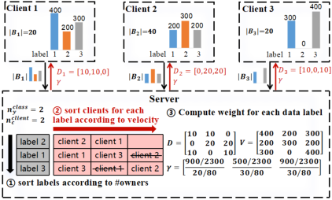

**Figure 6: A simple example to illustrate the greedy coordination.** ① **Sort labels according to** # **owners and obtain label order** {2 _,_ 1 _,_ 3} **;** ② **Sort and allocate clients for each label under the constraint of** _��_client **and** _�_class _�_ **;** ③ **Obtain coordination matrix** _�_ **and compute class weight** _�_ **according to (11).** 

## **B EMPIRICAL RESULTS FOR CLAIMS.** 

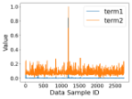

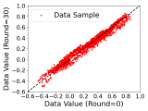

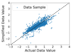

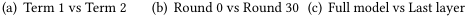

<!-- Start of picture text -->
(a) Term 1 vs Term 2 (b) Round 0 vs Round 30 (c) Full model vs Last layer <!-- End of picture text -->

**Figure 7: Empirical results to support some claims, and the experiment setting could be found in §4.1. (a): comparison of the normalized values of two terms in (3) and (5). (b): comparison of the data values computed in round 0 and round 30. (c): comparison of the data values computed using gradients of full model layers and the last layer.** 

Empirical results to support some claims mentioned before, and the experiment setting could be found in §4.1. Figure 7(a): comparison of the normalized values of two terms in (3) and (5). Figure 7(b): comparison of the data values computed in round 0 and round 30. Figure 7(c): comparison of the data values computed using gradients of full model layers and the last layer. 

## **C EXPERIMENTS** 

## **C.1 Tasks and Datasets** 

**Synthetic Task.** The synthetic dataset we used is proposed in LEAF benchmark [10] and is also described in details in [44]. It contains 200 clients and 1 million data samples, and a Logistic Regression model is trained for this 10-class task. 

**Image Classifcation.** Fashion-MNIST [73] contains 60 _,_ 000 training images and 10 _,_ 000 testing images, which are divided into 50 clients according to labels [46]. We train LeNet [37] for the 10-class image classifcation. 

WWW ’23, April 30–May 04, 2023, Austin, TX, USA 

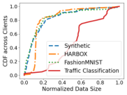

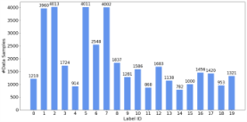

**Figure 8: Unbalanced data Figure 9: Data distribution in trafquantity of clients. fc classifcation dataset.** 

**Human Activity Recognition.** HARBOX [54] is the 9-axis OMU dataset collected from 121 users’ smartphones in a crowdsourcing manner, including 34,115 data samples with 900 dimension. Considering the simplicity of the dataset and task, a lightweight customized DNN with two dense layers followed by a SoftMax layer is deployed for this 5-class human activity recognition task [41]. 

**Trafc Classifcation.** The industrial dataset about the task of mobile application classifcation is collected by our deployment of 30 ONTs (optimal network terminal) in a simulated network environment from May 2019 to June 2019. Generally, the dataset contains more than 560 _,_ 000 data samples and has more than 250 applications as labels, which cover the application categories of videos (such as YouTube and TikTok), games (such as LOL and WOW), fles downloading (such as AppStore and Thunder) and communication (such as WhatsApp and WeChat). We manually label the application of each data sample. The model we applied is a CNN consisting of 4 convolutional layers with kernel size 1 × 3 to extract features and 2 fully-connected layers for classifcation, which is able to achieve 95% accuracy through CL and satisfy the on-device resource requirement due to the small number of model parameters. To reduce the training time caused by the large scale of dataset, we randomly select 20 out of 250 applications as labels with various numbers of data samples, whose distribution is shown in Figure 9. 

## **C.2 Confgurations** 

For all the experiments, we use SGD as the optimizer and decay the learning rate per 100 rounds by _�_ new = 0 _._ 95 × _�_ old. To simulate the setting of streaming data, we set the on-device data velocity to #training samples be _��_ = <u>500</u> , which means that each device _�_ ∈ _�_ will receive _��_ data samples one by one in each communication round, and the samples would be shufed and appear again per 500 rounds. Other default confgurations are shown in Table 1. Note that the participating clients in each round are randomly selected, and for each experiment, we repeat 5 times and show the average results. 

## **C.3 Baselines** 

(1) **Random sampling methods** including _RS_ (Reservoir Sampling [65]) and _FIFO_ (First-In-First-Out: storing the latest | _��_ | data samples)4 . 

(2) **Importance sampling-based methods** including _HighLoss (HL)_ , using the loss of each data sample as data value to refect the informativeness of data [45, 56, 61], and _GradientNorm (GN)_ , quantifying the impact of each data sample on model update through its gradient norm [30, 79]. 

> 4The experiment results of the two random sampling methods are similar, and thus we choose _RS_ for random sampling only. 

3054 

WWW ’23, April 30–May 04, 2023, Austin, TX, USA 

Chen Gong, Zhenzhe Zheng, Yunfeng Shao, Bingshuai Li, Fan Wu, and Guihai Chen 

(3) **Previous data selection methods** for canonical FL including _FedBalancer (FB)_ [60] and _SLD_ (Sample-Level Data selection) [39] which are revised slightly to adapt to streaming data setting: (i) We store the loss/gradient norm of the latest 50 samples for noise removal; (ii) For _FedBalancer_ , we ignore the data samples with loss larger than top 10% loss value, and for _SLD_ , we remove the samples with gradient norm larger than the median norm value. 

(4) **Ideal case** with unlimited on-device storage, denoted as _FullData (FD)_ , using the entire dataset of each client for training to simulate the unlimited storage scenario,. 

## **C.4 Motivating Experiments** 

In this section, We provide the complete experimental evidences for our motivation. First, we prove that the properties of limited on-device storage and streaming data can deteriorate the classic FL model training process signifcantly in various settings, such as diferent numbers of local training epochs and diferent data heterogeneity among clients. Then, we analyze the separate impact of theses two properties on FL with diferent data selection methods. Due to limited space, we only provide the main conclusions here and the details of the experiment settings and results are provided in the technical report [24]. 

cause the inaccurate estimation for global gradient, which further misleads the clients to select samples using a wrong valuation metric. 

**Cross-Client Coordination.** Empirical result shows that without the cross-client coordination component, the performance of ODE is largely weakened, as the clients tend to store similar and overlapped valuable data samples and the other data will be underrepresented. 

The results altogether show that each component is critical for the good performance of ODE. 

## **D PROOFS** 

The full proofs of theorems and lemmas are also provided in the technical report [24] due to limited space. 

The main results are: (1) When the number of local epoch _�_ increases, the negative impact of limited on-device storage is becoming more serious due to larger steps towards the biased update direction, slowing down the convergence time 3 _._ 92× and decreasing the fnal model accuracy by as high as 6 _._ 7%; (2) With the variance of local data increasing, the reduction of convergence rate and model accuracy is becoming larger. This is because the stored data samples are more likely to be biased due to wide data distribution; (3) The property of streaming data prevents previous methods from making accurate online decisions, as they select each sample according to a normalized probability depending on both discarded and upcoming samples, which are not available in streaming setting. But ODE selects each data sample through a deterministic valuation metric, not afected by the other samples; (4) The property of limited storage is the essential failure of existing data selection methods as it prevents previous methods from obtaining full local and global data information, guiding clients to select suboptimal data from an insufcient candidate dataset. In contrast, ODE allows clients to select valuable samples with global information from server. 

## **C.5 Component-wise Analysis** 

In this subsection, we evaluate the efectiveness of each of the three components in ODE: on-device data selection, global gradient estimator and cross-client coordination strategy. The detailed experimental settings, results and analysis are presented in the technical report [24], and we only present the main conclusions here. 

**On-Client Data Selection.** The result shows that without data valuation module, _Valuation-_ performs slightly better than _RS_ but much worse than _ODE-Est_ , which demonstrates the signifcant role of our data valuation and selection metric. 

**Global Gradient Estimator.** Experimental results show that using the naive estimation method instead of our proposed local and global gradient estimators will lead to really poor performance, as the partial client participation and biased local gradient will 

3055 

